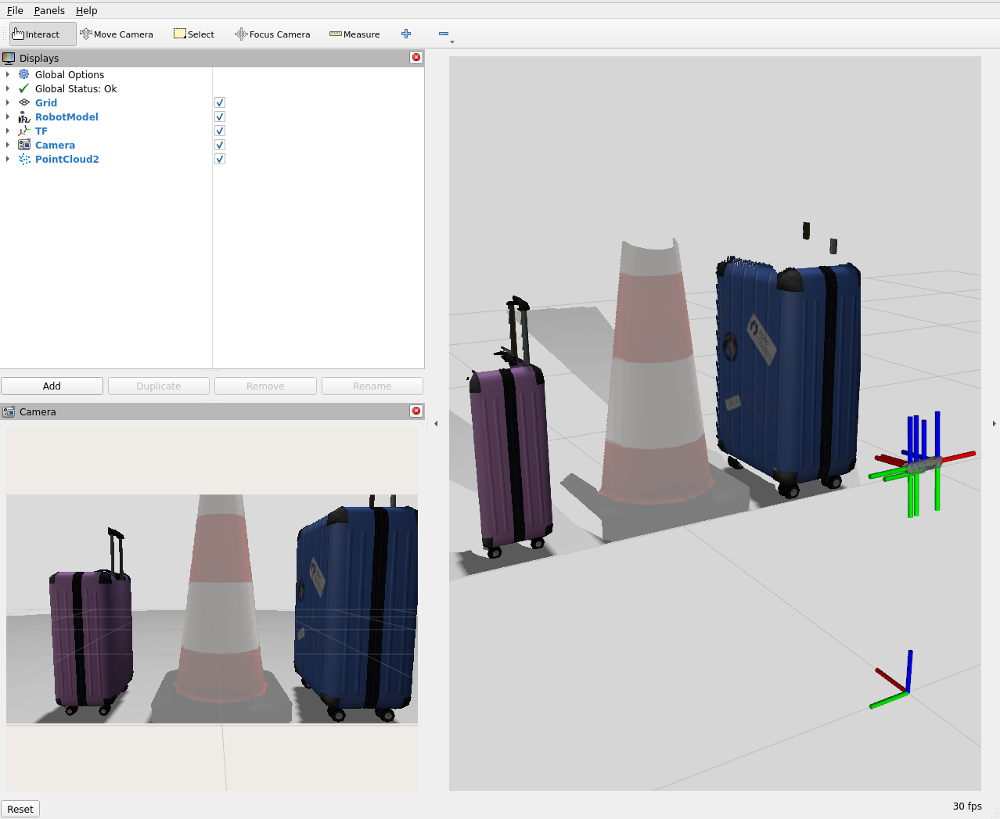

# Realsense Gazebo description

[](https://github.com/MarqRazz/realsense2_gz_description/actions/workflows/format.yaml)

Description: This ROS 2 package is designed to be used in unison with [realsense2_description](https://github.com/IntelRealSense/realsense-ros/tree/ros2-master/realsense2_description) and allows for easy definition of Realsense cameras that can be simulated in Gazebo Fortress and newer. It may support other versions of Ignition Gazebo but this has not been tested.

## Running Example Launch

This package includes a launch file to start Gazebo, bridge the data to ROS 2 and display the simulated camera data in Rviz.

Once you have built this package and sourced your workspace you can run
```bash
ros2 launch realsense2_gz_description example_realsense_gazebo.launch.py
```

> Note: you can specify `headless:=false` and it will also open the Gazebo GUI.

Which should start a simulated camera in Gazebo with a few objects in front of it. In the Rviz window that launches you can see the RGB images streaming along with the point cloud in the main view.




# Example Usage in URDF

In your robots urdf.xacro include the desired Realsense model along with its Gazebo description.
```xml
<xacro:include filename="$(find realsense2_description)/urdf/_d415.urdf.xacro" />
<xacro:include filename="$(find realsense2_gz_description)/urdf/_d415.gazebo.xacro" />

```
Then call the xacros and specify the same `name` and other optional arguments.
```xml
<!-- URDF xacro-->
<xacro:sensor_d415 parent="world" name="$(arg camera_name)" ...>
  <origin xyz="0 0 0" rpy="0 0 0"/>
</xacro:sensor_d415>
<!-- Gazebo xacro-->
<xacro:gazebo_d415 name="$(arg camera_name)" .../>
```

> Note: Gazebo plugins can only be included once so the xacros in this repo assume that a parent will include/run the required Sensors plugin when starting simulation.
This plugin can be started from your URDF or world.sdf file.
```xml
<gazebo>
  <plugin filename="libignition-gazebo-sensors-system.so" name="ignition::gazebo::systems::Sensors">
    <render_engine>ogre2</render_engine>
  </plugin>
</gazebo>
```

you can also refer to the the [example.urdf.xacro](./urdf/example_d415_gazebo.urdf.xacro) included.

## Gazebo only features

Gazebo offers a triggered based RGB camera that can be enabled by passing `triggered="true"` to the Gazebo description xacro.
Currently this feature does not appear to not work with the RGBD sensor, but will hopefully be added soon.
Switching the camera to only `trigger` when requested allows developers to better control the computation load required by each sensor.
Note triggering is not a feature the Realsense hardware offers unfortunately.

To trigger the camera from the command line you can publish on the Gazebo topic `camera_name/trigger`.
```bash
ign topic -t "/name/trigger" -m Boolean -p "data: true" -n 1
```

## Contributing

pre-commit is a tool to automatically run formatting checks on each commit, which saves you from manually running them.
This repo requires formatting to pass before changes will be accepted.

Install pre-commit like this:

```
pip3 install pre-commit
```

Run this in the top directory of the repo to set up the git hooks:

```
pre-commit install
```


# 中文

```markdown
# Realsense Gazebo 描述

[](https://github.com/MarqRazz/realsense2_gz_description/actions/workflows/format.yaml)

**描述**：这个 ROS 2 包旨在与 [realsense2_description](https://github.com/IntelRealSense/realsense-ros/tree/ros2-master/realsense2_description) 一起使用，能够方便地定义可在 Gazebo Fortress 及更新版本中仿真的 Realsense 相机。它可能也支持其他版本的 Ignition Gazebo，但尚未经过测试。

## 运行示例启动文件

这个包包含一个启动文件，可以启动 Gazebo、将数据桥接到 ROS 2，并在 Rviz 中显示仿真的相机数据。

构建好此包并 source 你的工作空间后，可以运行：
```bash
ros2 launch realsense2_gz_description example_realsense_gazebo.launch.py
```

> 注意：你可以设置 `headless:=false`，这样也会打开 Gazebo GUI。

运行后，Gazebo 中会出现一个仿真相机，相机前方有几个物体。在打开的 Rviz 窗口中，你可以看到 RGB 图像流以及主视图中的点云。


## 在 URDF 中的使用示例

在你的机器人的 urdf.xacro 文件中，包含所需的 Realsense 模型及其 Gazebo 描述：
```xml
<xacro:include filename="$(find realsense2_description)/urdf/_d415.urdf.xacro" />
<xacro:include filename="$(find realsense2_gz_description)/urdf/_d415.gazebo.xacro" />
```
然后调用这些 xacro，并指定相同的 `name` 和其他可选参数：
```xml
<!-- URDF xacro-->
<xacro:sensor_d415 parent="world" name="$(arg camera_name)" ...>
  <origin xyz="0 0 0" rpy="0 0 0"/>
</xacro:sensor_d415>
<!-- Gazebo xacro-->
<xacro:gazebo_d415 name="$(arg camera_name)" .../>
```

> 注意：Gazebo 插件只能被包含一次，因此本仓库中的 xacro 假设父级会在启动仿真时包含/运行所需的 Sensors 插件。
这个插件可以从你的 URDF 或 world.sdf 文件中启动：
```xml
<gazebo>
  <plugin filename="libignition-gazebo-sensors-system.so" name="ignition::gazebo::systems::Sensors">
    <render_engine>ogre2</render_engine>
  </plugin>
</gazebo>
```

你也可以参考包含的 [example.urdf.xacro](./urdf/example_d415_gazebo.urdf.xacro) 文件。

## Gazebo 特有功能

Gazebo 提供了一个基于触发的 RGB 相机，可以通过向 Gazebo 描述 xacro 传递 `triggered="true"` 来启用。
目前这个功能似乎还不能与 RGBD 传感器一起工作，但希望很快能添加支持。
将相机切换为仅在请求时触发，可以让开发者更好地控制每个传感器所需的计算负载。
需要注意的是，触发功能并非 Realsense 硬件本身具备的功能。

要从命令行触发相机，你可以在 Gazebo 主题 `camera_name/trigger` 上发布：
```bash
ign topic -t "/name/trigger" -m Boolean -p "data: true" -n 1
```

## 贡献

pre-commit 是一个工具，可以在每次提交时自动运行格式检查，从而免去手动运行的麻烦。
本仓库要求通过格式检查后才会接受更改。

安装 pre-commit 如下：
```
pip3 install pre-commit
```

在仓库的顶层目录中运行以下命令来设置 git 钩子：
```
pre-commit install
```